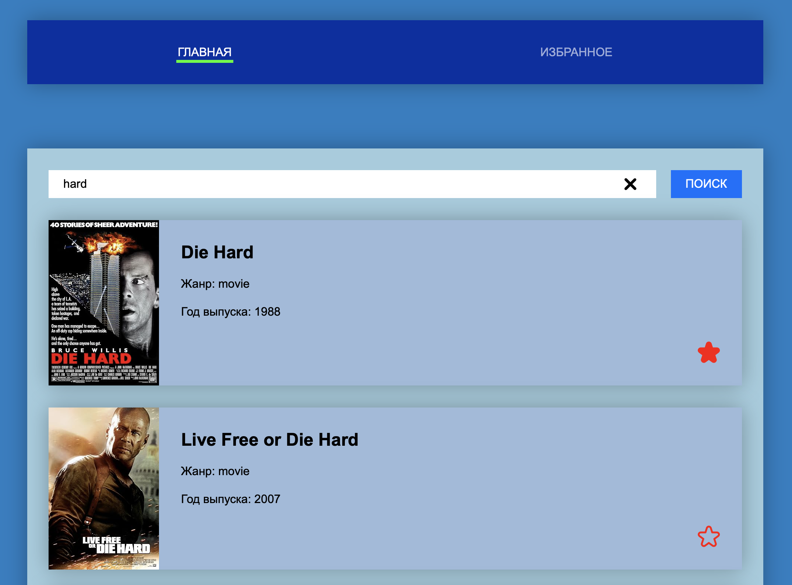

[](https://github.com/professor-severus-snape/movie-search/actions/workflows/vite_ci-cd.yml)

# Movie search

Приложение для поиска фильмов через `OMDb API` с возможностью добавления фильмов в «Избранное».



## Демо

Посмотреть демо можно [здесь](https://professor-severus-snape.github.io/movie-search/).

## Возможности

- Поиск фильмов по названию (на английском языке)
- Просмотр подробной информации о фильме
- Добавление и удаление фильмов из «Избранного»
- Навигация без перезагрузки страницы (SPA)
- Работа с динамическими маршрутами

## API

Приложение использует OMDb API для поиска фильмов и получения подробной информации.

### Базовый URL

```bash
https://www.omdbapi.com/
```

### Ключи для API

- `64405bd2`
- `9713c5e7`

### Возможные варианты запросов

```bash
# поиск списка фильмов по названию:
http://www.omdbapi.com/?apikey={apikey}&s={FILM_NAME}

# получение одного конкретного фильма по его названию:
http://www.omdbapi.com/?apikey={apikey}&t={FILM_NAME}

# получение одного конкретного фильма по его IMDb ID:
http://www.omdbapi.com/?apikey={apikey}&i={FILM_ID}
```

## Технологии

- React v19
- роутинг - React Router v7
- глобальный стейт менеджер - Redux Toolkit v2
- типизация - TypeScript v6
- линтинг - ESLint v10
- сборка - Vite v8

## CI/CD

- GitHub Actions - линтинг и сборка проекта (CI)
- GitHub Pages - автоматический деплой приложения (CD)
